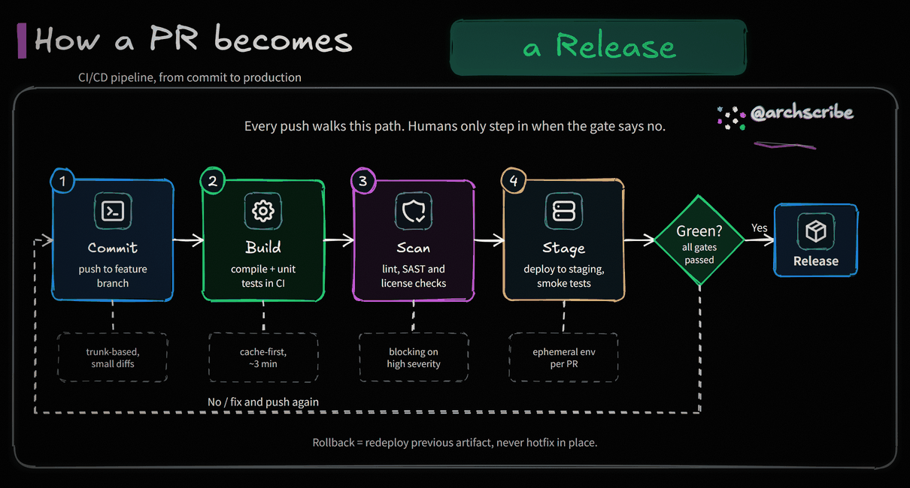
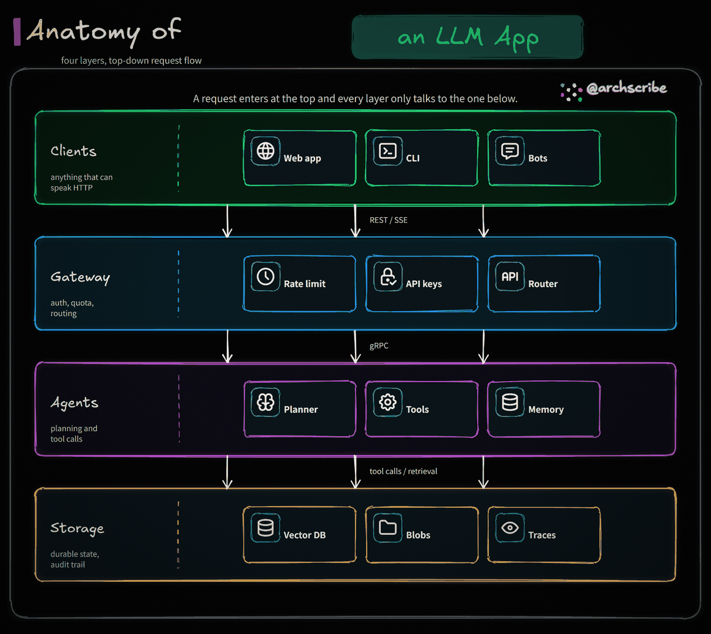

<div align="center">

# Archscribe

**Premium hand-drawn, dark-background animated architecture & process diagrams for articles, systems, and workflows.**

[](./SKILL.md)
[](https://www.python.org/)
[](https://python-pillow.org/)
[](https://excalidraw.com/)
[](./scripts/render_animated_diagram.py)
[](./LICENSE)

`JSON spec` -> `.excalidraw` + `.png` + animated `.gif`

[简体中文](./README.md) · **English**

</div>

<p align="center">
  <a href="#gallery">Gallery</a> ·
  <a href="#layouts">Layouts</a> ·
  <a href="#styles">Styles</a> ·
  <a href="#quick-start">Quick Start</a> ·
  <a href="#features">Features</a> ·
  <a href="#spec-structure">Spec</a> ·
  <a href="#verification">Verification</a>
</p>

`archscribe` is a Codex / Claude skill and local renderer for creating premium black-canvas technical diagrams with hand-drawn typography, editable Excalidraw output, static PNG previews, and genuinely animated GIFs.

It is designed for article explanations, system architecture diagrams, process diagrams, and DailyDoseOfDS-style black-background technical sketches.

## Gallery

The default visual system uses a dark canvas, moving flow highlights, animated icon micro-interactions, pulsing modules, subtle grain, vignette, and a top-right hand-drawn signature.

<table>
  <tr>
    <td width="50%" align="center">
      <strong>Animated GIF</strong><br />
      
    </td>
    <td width="50%" align="center">
      <strong>Static PNG</strong><br />
      
    </td>
  </tr>
</table>

## Layouts

Three templates cover most explanations. Pick one with a `"layout"` field in
the spec; content counts are elastic and the canvas height adapts.

| Layout | Best for | Preview |
| --- | --- | --- |
| `panorama` (default) | whole systems: sources → core pipeline → storage/output panels |  |
| `pipeline` | linear processes: CI/CD, approval flows, lifecycles |  |
| `layers` | stacks: N-tier architectures, tech stacks, protocol layers |  |

## Styles

Archscribe ships with **4 built-in styles**. The diagram layout, animation, and
icons stay identical; only the palette (and the finish for light styles) changes.
Pick one with the `--style` CLI flag or a `"style"` field in the spec.

| Style | Look | Preview |
| --- | --- | --- |
| `default` | Dark hand-drawn neon on pure black (brand default) |  |
| `blueprint` | Deep navy monochrome, technical blueprint feel |  |
| `terminal` | Near-black canvas with phosphor-green CRT tones |  |
| `candy` | Fresh, cute pastel on a light paper canvas |  |

Select a style on the command line (overrides the spec):

```bash
python3 scripts/render_animated_diagram.py \
  --spec assets/default-spec.json \
  --outdir outputs \
  --basename my-diagram \
  --style candy
```

Or pin it in the spec JSON so the diagram always renders in that style:

```json
{
  "style": "blueprint",
  "canvas": { "width": 1210, "height": 1138, "fps": 20, "frames": 41 }
}
```

If both are present, `--style` wins. When neither is set, the renderer uses
`default`.

## Features

- 3 layout templates via a spec `layout` field: `panorama` (elastic full-system view, 2-6 inputs / 2-4 core cards / optional panels), `pipeline` (2-6 stages, optional decision + retry loop + notes), `layers` (2-5 stacked bands with items)
- Browser renderer (default): rough.js hand-drawn shapes + bundled Excalifont / Noto Sans SC webfonts inside headless Chromium — genuine Excalidraw look, identical on every OS
- 3 animation presets via `--animation`: `flow` (eased energy beams + ripples + wave breathing), `draw` (whiteboard build-up), `relay` (narrative hand-off on a dimmed canvas), plus per-style ambient layers — all presets work on all layouts
- Generates `.excalidraw`, `.png`, `.gif`, `.mp4`, standalone `.svg`, and an interactive `.html` from one JSON spec (`--formats`)
- Interactive HTML: click a module to highlight its connections, toggle the full BFS chain, hover tooltips, keyboard accessible — single self-contained file
- MP4 output is a fraction of the GIF size and natively supported by X / WeChat; GIF uses a shared global palette for small files
- Ships with 4 selectable styles (`default`, `blueprint`, `terminal`, `candy`) via `--style` or a spec `style` field
- Spec pre-flight validation (`--validate-only` or automatic before render) with field-level `path` / `message` / `fix` errors, built for agent self-correction
- Brand customization: any item takes `icon_file` (local SVG/PNG rendered in its original colors — product logos, colorful icons); `left_panel.badge_file` puts a logo in the panel header; `input_style: "plain"` gives frameless colorful input icons; `down_label` / `up_label` / `yes_label` rename the built-in arrow labels; long signatures (domains) auto-shift and stretch their underline instead of clipping
- Keeps the `.excalidraw` source editable and text-based
- Bundled fonts (OFL) and Tabler SVG icon subset (MIT); works offline with no remote assets at render time; icons get a wave-ordered micro "pop" in the `flow` preset
- `--check` validates the full output contract (dimensions, frames, real motion, MP4 stream, SVG fonts, HTML hotspots, Excalidraw invariants); `--verify` prints a frame-diff report
- Classic Pillow pipeline retained as `--renderer pillow` fallback

## Outputs

Default render (`--renderer browser`):

```text
<basename>.excalidraw
<basename>.png
<basename>.gif
<basename>.mp4
```

Optional: `<basename>.svg` (fonts embedded, opens standalone) and
`<basename>.html` (interactive click-to-explore page). The canvas is
`1210 x <computed>` at 20 fps — each layout computes its height from content
(the classic panorama is `1210 x 1138`); `flow` uses 41 frames (~2 s loop),
`draw` 72+, `relay` 88+.

## Quick Start

```bash
git clone https://github.com/lazypay/Archscribe.git
cd Archscribe
python3 -m pip install -r requirements.txt
python3 scripts/render_animated_diagram.py \
  --spec assets/default-spec.json \
  --outdir outputs \
  --basename sample \
  --verify
```

## Installation

Place this folder in your Codex skills directory:

```bash
~/.codex/skills/archscribe
```

Typical local install path:

```bash
${CODEX_HOME:-$HOME/.codex}/skills/archscribe
```

Install the runtime dependency:

```bash
python3 -m pip install -r requirements.txt
```

## Use With Codex

Invoke the skill by name:

```text
Use $archscribe to turn this article into a premium hand-drawn animated architecture GIF.
```

Chinese prompt example:

```text
用 $archscribe 把这篇文章整理成手绘动态架构图（岚叔 / DailyDoseOfDS 风格），输出 GIF、PNG 和 Excalidraw。
```

## CLI Usage

Start from the bundled template:

```bash
cp assets/default-spec.json work/my-diagram-spec.json
```

Render:

```bash
python3 scripts/render_animated_diagram.py \
  --spec work/my-diagram-spec.json \
  --outdir outputs \
  --basename my-diagram \
  --style default \
  --animation flow \
  --verify \
  --check
```

Key flags:

- `--renderer auto|browser|pillow` — `browser` (default when available)
  replays the layout with rough.js in headless Chromium; `pillow` is the
  classic raster fallback.
- `--animation flow|draw|relay` — motion preset (browser renderer). Overrides
  the spec `animation` field.
- `--formats gif,mp4,png,svg,html,excalidraw` — pick outputs; browser default
  is `gif,mp4,png,excalidraw`.
- `--style default|blueprint|terminal|candy` — palette. See [Styles](#styles).
- `--validate-only` — check the spec and exit (field-level errors/warnings as
  JSON, exit 2 on errors); every render also validates first.
- `--verify` — prints sampled frame differences (nonzero pixels = real motion).
- `--check` — validates the full output contract (PNG/GIF dimensions, frame
  count, FPS, motion, MP4 stream properties, SVG font embedding, HTML
  hotspots, Excalidraw invariants) and exits nonzero on failure.
- `--icon-engine` — icon fidelity for the pillow fallback pipeline only.

For fast layout iteration, render `--formats png` first (seconds), then run
the full render once the layout is right.

## Spec Structure

Pick a layout, then fill its content fields. Templates to copy:
`assets/default-spec.json` (panorama), `assets/examples/pipeline-spec.json`,
`assets/examples/layers-spec.json`.

```text
layout         (optional: panorama | pipeline | layers; default panorama)
style          (optional: default | blueprint | terminal | candy)
animation      (optional: flow | draw | relay)
signature
title.prefix / title.highlight / title.subtitle

panorama:  inputs (2-6), core.cards (2-4), decision, output,
           left_panel / center_panel / right_panel (each optional, needs cards)
pipeline:  stages (2-6, each title/body/icon + optional note),
           decision (optional, no_label draws the retry loop), output, footer
layers:    layers (2-5, each title/subtitle/items(0-5)/connection_label)
```

Custom icons / logos: every item that accepts `icon` also accepts `icon_file`
(a local `.svg` / `.png`; relative paths resolve against the spec file's
folder). The browser renderer embeds it with its original colors — ideal for
brand logos. `left_panel.badge_file` swaps the text badge for a logo image.

Supported icon keys:

```text
folder
file
scan
shield
db
hash
package
message
event
api
clock
brain
gear
eye
terminal
globe
video
snapshot
server
lock
check
clipboard
```

For details, see [references/spec-format.md](./references/spec-format.md).

## Verification

Validate the skill structure:

```bash
python3 ${CODEX_HOME:-$HOME/.codex}/skills/.system/skill-creator/scripts/quick_validate.py \
  ${CODEX_HOME:-$HOME/.codex}/skills/archscribe
```

Validate GIF media parameters:

```bash
ffprobe -v error -select_streams v:0 -count_frames \
  -show_entries stream=width,height,r_frame_rate,avg_frame_rate,nb_read_frames \
  -show_entries format=duration \
  -of default=noprint_wrappers=1 outputs/my-diagram.gif
```

Validate animation:

```bash
python3 scripts/render_animated_diagram.py \
  --spec assets/default-spec.json \
  --outdir outputs \
  --basename sample \
  --verify \
  --check
```

## Dependencies

Required:

- Python 3.9+
- Pillow 10.0.0+
- svg.path 7.0+

Install Python packages with:

```bash
python3 -m pip install -r requirements.txt
```

Recommended (browser renderer — hand-drawn shapes, animation presets, SVG):

```bash
python3 -m pip install -r requirements-browser.txt
python3 -m playwright install chromium
```

Optional tools:

- `ffmpeg` for MP4 output (skipped gracefully when missing), `ffprobe` for media inspection
- Excalidraw web app or editor plugin for manual editing of generated `.excalidraw` files

Bundled assets (no downloads at render time):

- `assets/fonts/` — Excalifont + Noto Sans SC subset (OFL-1.1), see `assets/fonts/README.md`
- `assets/vendor/rough.js` — rough.js 4.6.6 (MIT)
- `assets/icons/tabler/` — Tabler icon subset (MIT)

## Project Layout

```text
archscribe/
├── SKILL.md
├── README.md            # 简体中文 (default)
├── README.en.md         # English (this file)
├── LICENSE
├── requirements.txt
├── requirements-browser.txt
├── agents/
│   └── openai.yaml
├── assets/
│   ├── default-spec.json              # panorama template
│   ├── examples/
│   │   ├── pipeline-spec.json         # pipeline layout template
│   │   └── layers-spec.json           # layers layout template
│   ├── fonts/                     # bundled Excalifont + Noto Sans SC (OFL)
│   ├── vendor/                    # rough.js (MIT)
│   ├── icons/
│   │   └── tabler/
│   └── previews/
│       ├── memory-pack.gif        # default style, animated hero
│       ├── memory-pack.png
│       ├── layout-pipeline.png
│       ├── layout-layers.png
│       ├── style-blueprint.png
│       ├── style-terminal.png
│       └── style-candy.png
├── docs/
│   └── interactive-output-design.md   # 2.0 roadmap
├── references/
│   └── spec-format.md
├── scripts/
│   ├── render_animated_diagram.py     # CLI + validation + pillow pipeline + op recorder
│   ├── svg_renderer.py                # rough.js browser renderer + animation + HTML
│   ├── graph_model.py                 # layout planner + graph topology
│   ├── prepare_fonts.py               # one-time font asset builder
│   └── icon_browser.py                # legacy icon engine (pillow pipeline)
└── tests/
    ├── test_render_output_checks.py
    ├── test_text_fitting.py
    ├── test_graph_model.py
    ├── test_bundled_fonts.py
    └── test_ops_and_browser.py
```

## Design Notes

This project intentionally keeps the visual system narrow:

- Dark canvas, hand-drawn title treatment, top-right signature
- Three art-directed layout templates instead of a free-form layout engine
- One geometry source (`scripts/graph_model.py` plans) drives the Pillow
  raster, the browser SVG render, the animation paths, and the interactive
  HTML graph — they can never drift apart
- Clean static diagram with motion added only in overlays: beams, ripples,
  breathing, icon sweeps

That constraint keeps outputs consistent and polished across different architecture topics.

## Acknowledgements

The dark hand-drawn animated visual style is inspired by **岚叔**'s animated
architecture diagrams and **DailyDoseOfDS**-style black-background technical
sketches. Archscribe is an independent re-implementation of that look as an open
skill; all credit for the original aesthetic goes to those creators.

## License

MIT

Bundled icons in `assets/icons/tabler` are from Tabler Icons and are MIT
licensed; see `assets/icons/tabler/LICENSE`.
