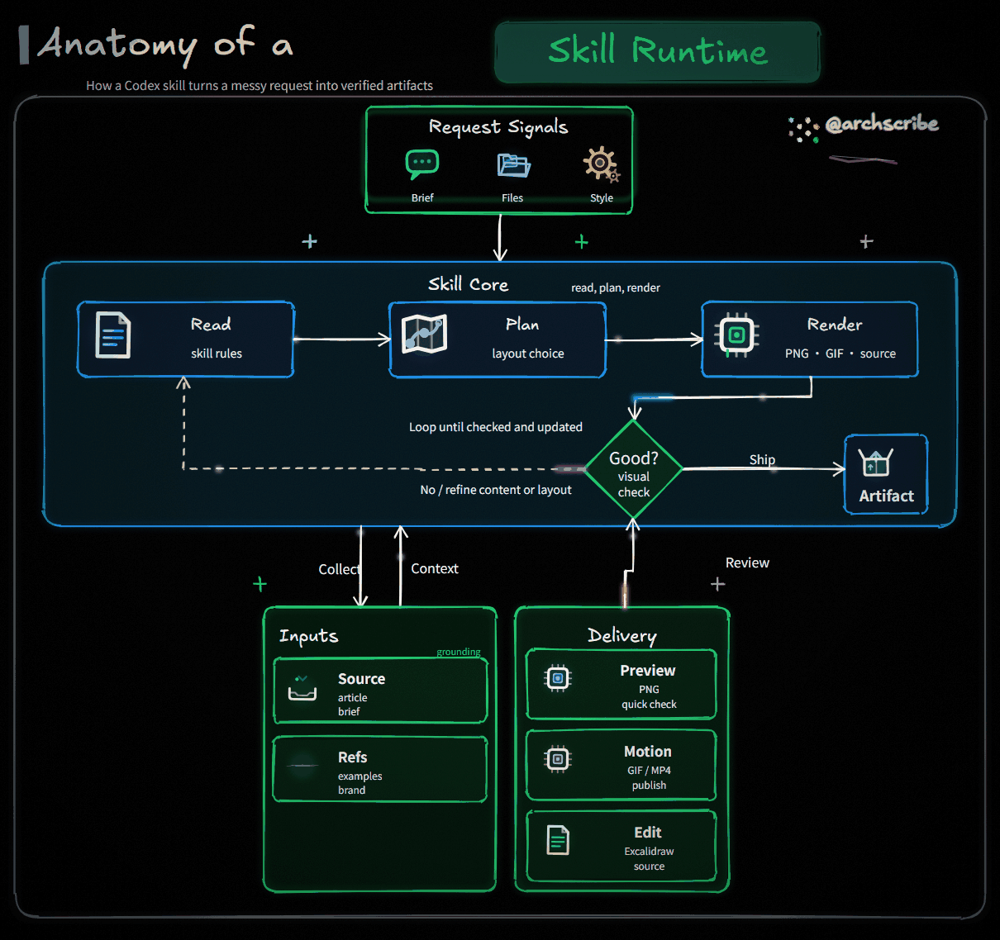
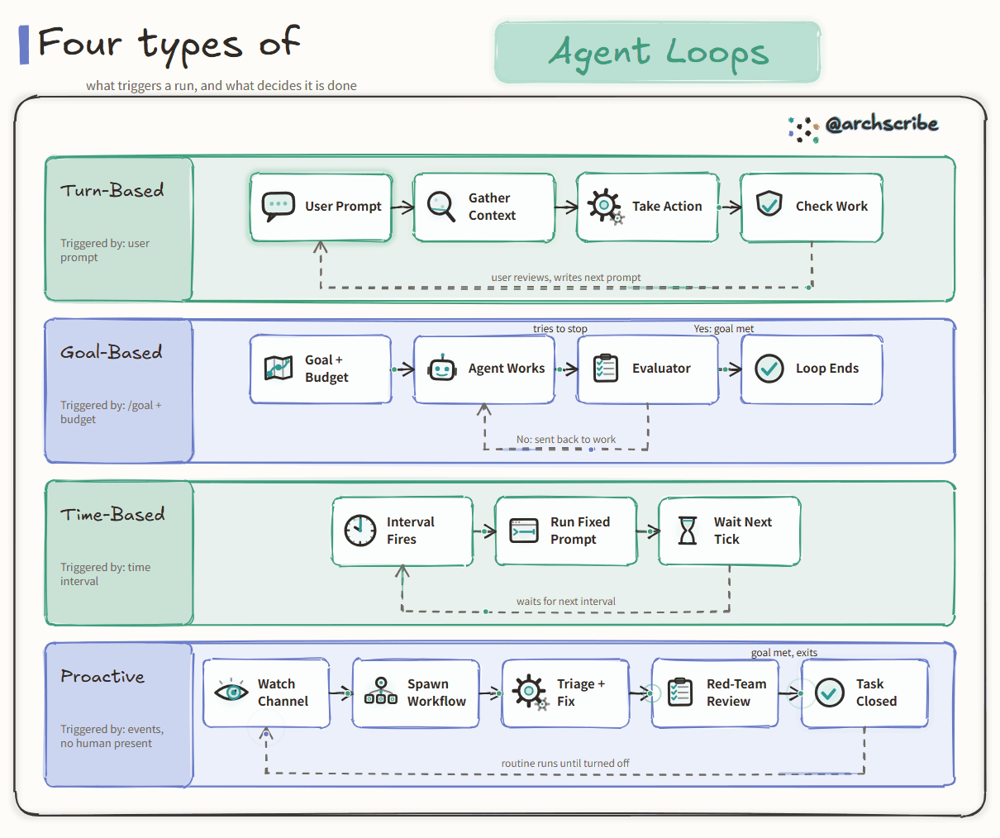
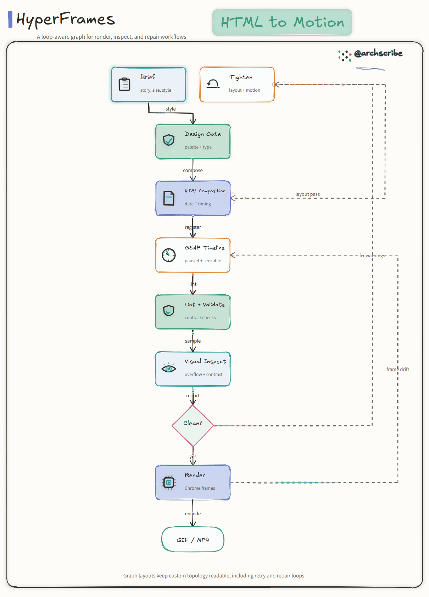
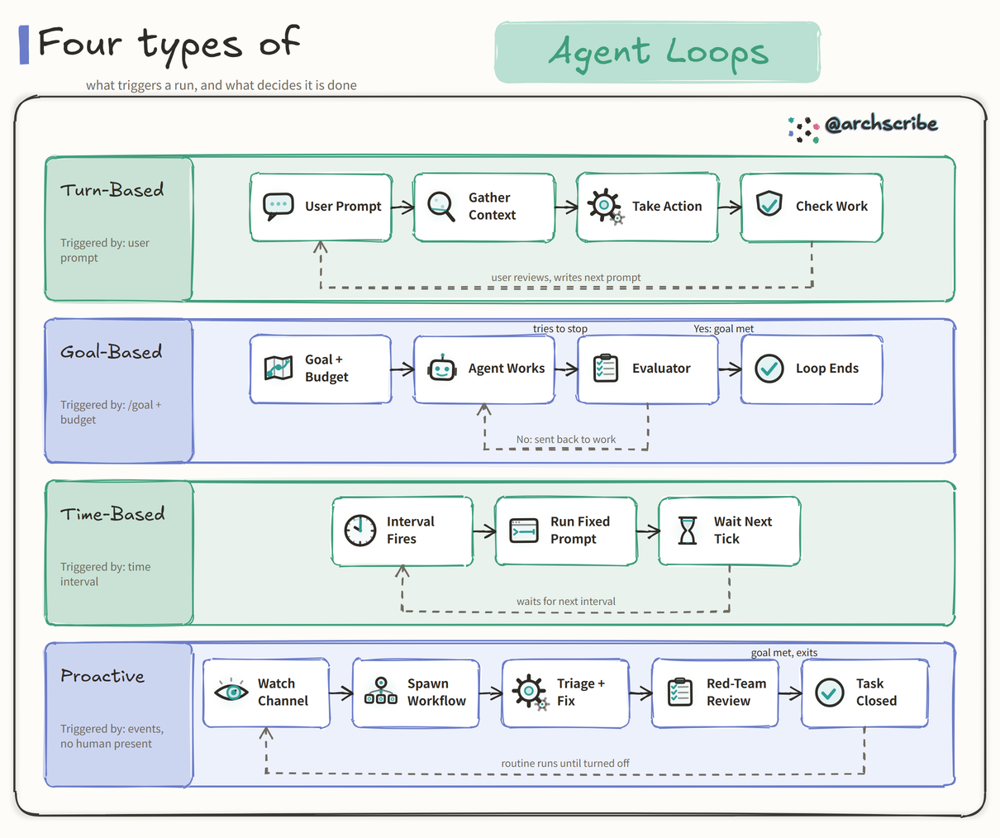
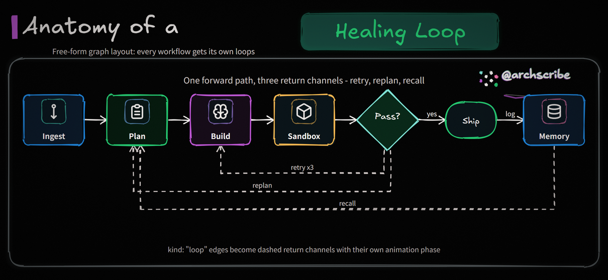

<div align="center">

# Archscribe

**高级手绘风动态架构 / 流程图,深色霓虹与浅色纸面双风格,专为文章、系统与工作流讲解打造。**

[](./SKILL.md)
[](https://www.python.org/)
[](https://python-pillow.org/)
[](https://excalidraw.com/)
[](./scripts/render_animated_diagram.py)
[](./LICENSE)

`JSON 配置` -> `.excalidraw` + `.png` + 动画 `.gif`

**简体中文** · [English](./README.en.md)

</div>

<p align="center">
  <a href="#画廊">画廊</a> ·
  <a href="#布局模板">布局</a> ·
  <a href="#风格">风格</a> ·
  <a href="#快速开始">快速开始</a> ·
  <a href="#功能特性">功能特性</a> ·
  <a href="#配置结构">配置</a> ·
  <a href="#校验">校验</a>
</p>

`archscribe` 是一个 Codex / Claude 技能 + 本地渲染器,用于生成高级感的手绘技术图:手绘字体、可编辑的 Excalidraw 源文件、静态 PNG 预览,以及真正会动的 GIF。

它适合用来做文章讲解、系统架构图、流程图,以及 DailyDoseOfDS 风格的技术草图——深色霓虹与浅色纸面两套观感。

## 画廊

三套首页案例分别展示 `panorama`、`swimlane`、`graph`。每个案例单独占一行,保留足够细节;同一份配置也可以通过 `--style default|paper` 切换深色霓虹或浅色纸面观感。

### 1. 系统全景:Skill Runtime (`panorama` + `default`)

适合把一个系统、产品、Agent 或文章主题拆成输入、核心流程、判断节点与交付产物。



```text
用 $archscribe 把这个 Skill / Agent 的工作机制整理成深色霓虹手绘全景图,展示输入、核心流程、质量检查和最终产物,输出 GIF、PNG 和 Excalidraw。
```

### 2. 分类对比:Agent Loops (`swimlane` + `paper`)

适合做 DailyDoseOfDS 风格的分类横带、对比表、角色泳道和知识卡片。



```text
用 $archscribe 画一张浅色纸面风格的分类泳道图,主题是「四种 Agent Loops」,每条泳道说明触发条件、关键步骤和回路关系。
```

### 3. 自定义拓扑:HTML to Motion (`graph` + `paper`)

适合表达 CI/CD、渲染管线、故障恢复、审核回路等不规则流程。长链路会自动向下堆叠,避免左右裁切和下半部分空白。



```text
用 $archscribe 把 HyperFrames 从 HTML composition 到校验、视觉检查、渲染和修复回路画成 graph 布局动态图,用浅色纸面风格输出 GIF。
```

## 布局模板

三套模板覆盖绝大多数讲解场景。在配置里用 `"layout"` 字段选择;内容数量弹性适配,画布高度自动计算。

| 布局 | 适合的内容 | 预览 |
| --- | --- | --- |
| `panorama`(默认) | 完整系统全景:输入源 → 核心管线 → 存储/产出面板 |  |
| `swimlane` | 分类横带 / 对比行(「N 种 X」)、跨角色协作、图标目录 |  |
| `graph` | 自由节点/边 + 自动 DAG + 专属回路通道,随项目定制 |  |

弹性说明:panorama 支持 2-6 个输入、2-4 张核心卡片,三个底部面板均可省略;swimlane 支持 2-5 条横带,每带 1-5 步,左侧标题列可加副标题(如 "Triggered by: ..."),带内从右往左的连线自动落入卡片下方的虚线回路通道;graph 支持 2-24 节点、40 条边的自由拓扑与 `kind: "loop"` 回路边——线性流程也用它表达,超过 7 个顺序层级的右向长链会自动向下堆叠。

## 风格

Archscribe 内置 **2 套风格**。图的布局、动画、图标完全一致,只有配色与收尾处理不同。通过命令行 `--style` 或配置文件里的 `"style"` 字段选择。

| 风格 | 观感 | 预览 |
| --- | --- | --- |
| `default` | 纯黑底手绘霓虹:流光光束、颗粒、暗角(品牌默认) |  |
| `paper` | 暖白纸面:鼠尾草绿 / 长春花蓝交替色带、近黑墨线、白卡彩描边,流动动画换成沿箭头移动的小圆点 |  |

在命令行选择风格(优先级高于配置文件):

```bash
python3 scripts/render_animated_diagram.py \
  --spec assets/examples/swimlane-spec.json \
  --outdir outputs \
  --basename my-diagram \
  --style paper
```

或写进配置 JSON,让该图始终用这套风格渲染:

```json
{
  "style": "paper",
  "canvas": { "fps": 20, "frames": 41 }
}
```

两者同时存在时,`--style` 优先;都不设置时使用 `default`。其余风格名会直接报错。`graph` 布局不建议手写 `canvas.width/height`;它会使用自然画布避免裁切和大面积空白。

## 功能特性

- 3 套布局模板(配置 `layout` 字段):`panorama` 系统全景、`swimlane` 分类横带(参考图同款:副标题列 + 交替色带 + 带内虚线回路)、`graph` 自由节点/边 + 自动 DAG + 回路通道;长 graph 会自动改为纵向堆叠防止裁切
- 浏览器主渲染器(默认):无头 Chromium 内用 rough.js 手绘每个形状 + 内置 Excalifont / 思源黑体 webfont——真正的 Excalidraw 观感,任何系统渲染结果一致
- 6 套动画预设(`--animation`):`flow`、`draw`、`relay`、`trace`、`chapter`、`failure-recovery`,布局全部支持
- 一份 JSON 配置生成 `.excalidraw`、`.png`、`.gif`、`.mp4`、独立 `.svg` 和交互 `.html`(`--formats` 选择)
- 交互 HTML:点击模块高亮它的连接,勾选「整条链路」看 BFS 全链传播,悬停显示提示,支持键盘;单文件可直接分享
- MP4 体积远小于 GIF,X / 微信公众号原生支持;GIF 使用全局共享调色板,体积小
- 2 套内置风格:`default` 深色霓虹、`paper` 浅色纸面(浅色下流光自动换成小圆点,无颗粒无暗角)
- `outline / illustrated / hero` 三级图标系统,以及脑部脉冲、齿轮旋转、眼睛扫描、记忆写入等确定性微动画(详见 `references/illustrated-icons.md`)
- 渲染前配置预检(`--validate-only` 或渲染时自动执行):字段级 `path` / `message` / `fix` 报错,方便 agent 自动修正
- 品牌定制:任意条目用 `icon_file` 指向本地 SVG/PNG 当彩色图标 / 产品 logo(保留原色);`left_panel.badge_file` 在面板头放品牌标;`input_style: "plain"` 输出参考图同款无框彩色输入图标;`down_label` / `up_label` / `yes_label` 改写内置箭头标签;超长签名(如域名)自动左移 + 下划线拉伸,不再裁剪
- `.excalidraw` 源文件保持可编辑、纯文本
- 内置字体(OFL)与 Tabler SVG 图标子集(MIT),完全离线渲染;`flow` 预设下图标还有波次弹跳微动效
- `--check` 校验完整输出契约(尺寸、帧数、真实动效、MP4 流参数、SVG 字体内嵌、HTML 热区、Excalidraw 不变量),并检查 graph 是否裁切、是否垂直失衡、长链是否安全换向;`--verify` 打印帧差报告
- 经典 Pillow 管线保留为 `--renderer pillow` 兜底

## 输出产物

默认渲染(`--renderer browser`)生成:

```text
<basename>.excalidraw
<basename>.png
<basename>.gif
<basename>.mp4
```

可选:`<basename>.svg`(内嵌字体,可独立打开)、`<basename>.html`(点击探索的交互页面)。画布宽 1210,高度由布局按内容计算(经典 panorama 为 `1210 x 1138`)@ 20 fps;`flow` 41 帧(约 2 秒循环),`draw` 至少 72 帧,`relay` 至少 88 帧。

## 快速开始

```bash
git clone https://github.com/lazypay/Archscribe.git
cd Archscribe
python3 -m pip install -r requirements.txt
python3 -X utf8 scripts/render_animated_diagram.py \
  --spec assets/default-spec.json \
  --outdir outputs \
  --basename sample \
  --verify \
  --check
```

## 安装

把本文件夹放进你的 Codex 技能目录:

```bash
~/.codex/skills/archscribe
```

常见的本地安装路径:

```bash
${CODEX_HOME:-$HOME/.codex}/skills/archscribe
```

安装运行依赖:

```bash
python3 -m pip install -r requirements.txt
```

## 在 Codex 中使用

按技能名直接调用:

```text
用 $archscribe 把这篇文章做成高级感手绘动态架构 GIF。
```

中文提示词示例:

```text
用 $archscribe 把这篇文章整理成手绘动态架构图（岚叔 / DailyDoseOfDS 风格），输出 GIF、PNG 和 Excalidraw。
```

```text
用 $archscribe 画一个 CI/CD 发布流程图（graph 布局），带失败重试回路，再给我一个能点击探索的 HTML。
```

> 关于浏览器图标引擎:`browser` 引擎是脚本通过 Playwright **自己拉起的无头 Chromium**,与 "Codex 内置浏览器" 无关,无需手动启动。只要装好 `requirements-browser.txt` 与 `python -m playwright install chromium`,后续会自动启用;未安装时会静默回退到 `pillow` 引擎。

## 命令行用法

从内置模板开始:

```bash
cp assets/default-spec.json work/my-diagram-spec.json
```

渲染:

```bash
python3 -X utf8 scripts/render_animated_diagram.py \
  --spec work/my-diagram-spec.json \
  --outdir outputs \
  --basename my-diagram \
  --style default \
  --animation flow \
  --verify \
  --check
```

关键参数:

- `--renderer auto|browser|pillow` — `browser`(可用时的默认)在无头 Chromium 里用 rough.js 重放布局;`pillow` 为经典栅格兜底。
- `--animation flow|draw|relay|trace|chapter|failure-recovery` — 动画预设(浏览器渲染器),优先级高于配置文件的 `animation` 字段。
- `--formats gif,mp4,png,svg,html,excalidraw` — 选择产物;浏览器渲染器默认 `gif,mp4,png,excalidraw`。
- `--style default|paper` — 配色,详见 [风格](#风格)。
- `--validate-only` — 只做配置预检并退出(JSON 格式的字段级报错/警告,有错误时退出码 2);正常渲染前也会自动预检。
- `--verify` — 打印抽样帧间差异(变化像素非零 = 真动画)。
- `--check` — 校验完整输出契约(PNG/GIF 尺寸、帧数、FPS、动效、MP4 流参数、SVG 字体内嵌、HTML 热区、Excalidraw 不变量),不通过则以非零码退出。
- `--strict-formats` — 发布时使用;只要请求的格式没有实际生成就失败,避免浏览器或 ffmpeg 缺失时静默少产物。
- `--icon-engine` — 仅影响 pillow 兜底管线的图标质量。

调试排版时先用 `--formats png` 快速出静态图(几秒),布局确认后再跑完整渲染。

## 配置结构

从示例配置起步:`assets/default-spec.json`(panorama)、`assets/examples/swimlane-spec.json`(paper 风格的「四种 agent 回路」参考款)、`assets/examples/graph-workflow-spec.json`(自由图),以及 `illustrated-loop` / `loop-icon-pack` / `illustrated-icon-catalog` 插画样例。

所有布局共享的字段:

```text
layout         (可选: panorama | swimlane | graph)
style          (可选: default | paper)
animation      (可选: flow | draw | relay | trace | chapter | failure-recovery)
signature
title.prefix
title.highlight
title.subtitle
```

`panorama` 专属:`inputs`(2-6)、`core.cards`(2-4)、`decision`、`output`、`left_panel` / `center_panel` / `right_panel`(均可省略)。

`swimlane` 专属:`lanes`(2-5,每条含 `title` / 可选 `subtitle` / 可选 `accent` / `steps`(1-5 个,每个含 `id` / `title` / 可选 `icon`))、可选 `connections`(`from` / `to` / `label` / `style` / `accent`;带内从右往左的连线自动走虚线回路通道)。

`graph` 专属:`nodes`(2-24)、`edges`(最多 40,支持 `kind: "loop"` 回路边)、`direction`(`right` 或 `down`)。超过 7 个顺序层级的右向长链会自动向下堆叠;`canvas.width/height` 会触发诊断警告并交由布局规划器计算自然尺寸。完整字段见 [references/spec-format.md](./references/spec-format.md);具象插画见 [references/illustrated-icons.md](./references/illustrated-icons.md)。

自定义图标 / logo:任何带 `icon` 的条目都可以改用 `icon_file`(本地 `.svg` / `.png`,相对路径以配置文件所在目录为基准),浏览器渲染器按原色嵌入,适合品牌 logo;`left_panel.badge_file` 则把面板头的文字徽标换成 logo 图片。

支持的图标键:

```text
folder  file    scan    shield  db      hash
package message event   api     clock   brain
gear    eye     terminal globe  video   snapshot
server  lock    check   clipboard
```

详细说明见 [references/spec-format.md](./references/spec-format.md)。

## 校验

校验技能结构:

```bash
python3 -X utf8 ${CODEX_HOME:-$HOME/.codex}/skills/.system/skill-creator/scripts/quick_validate.py \
  ${CODEX_HOME:-$HOME/.codex}/skills/archscribe
```

校验 GIF 媒体参数:

```bash
ffprobe -v error -select_streams v:0 -count_frames \
  -show_entries stream=width,height,r_frame_rate,avg_frame_rate,nb_read_frames \
  -show_entries format=duration \
  -of default=noprint_wrappers=1 outputs/my-diagram.gif
```

校验动画:

```bash
python3 -X utf8 scripts/render_animated_diagram.py \
  --spec assets/default-spec.json \
  --outdir outputs \
  --basename sample \
  --verify \
  --check
```

## 依赖

必需:

- Python 3.9+
- Pillow 10.0.0+
- svg.path 7.0+

安装 Python 包:

```bash
python3 -m pip install -r requirements.txt
```

推荐(浏览器主渲染器——手绘形状、动画预设、SVG 输出):

```bash
python3 -m pip install -r requirements-browser.txt
python3 -m playwright install chromium
```

可选工具:

- `ffmpeg`:MP4 输出(缺失时自动跳过);`ffprobe`:检查媒体参数
- Excalidraw 网页版或编辑器插件:手动编辑生成的 `.excalidraw` 文件

内置资产(渲染时零下载):

- `assets/fonts/` — Excalifont + 思源黑体子集(OFL-1.1),见 `assets/fonts/README.md`
- `assets/vendor/rough.js` — rough.js 4.6.6(MIT)
- `assets/icons/tabler/` — Tabler 图标子集(MIT)

## 项目结构

```text
archscribe/
├── SKILL.md
├── README.md            # 中文说明（本文件，默认）
├── README.en.md         # English
├── LICENSE
├── requirements.txt
├── requirements-browser.txt
├── agents/
│   └── openai.yaml
├── assets/
│   ├── default-spec.json          # panorama 示例
│   ├── examples/                  # 各布局与插画样例
│   ├── fonts/                     # 内置 Excalifont + 思源黑体（OFL）
│   ├── vendor/                    # rough.js（MIT）
│   ├── icons/
│   │   └── tabler/
│   └── previews/                  # GitHub 首页画廊与布局预览
├── docs/
│   └── interactive-output-design.md   # 2.0 路线图
├── references/
│   ├── spec-format.md
│   └── illustrated-icons.md
├── scripts/
│   ├── render_animated_diagram.py     # CLI + 配置预检 + pillow 管线 + op 录制
│   ├── svg_renderer.py                # rough.js 浏览器渲染器 + 动画引擎 + 交互 HTML
│   ├── graph_model.py                 # 布局规划器（几何 + 图拓扑）
│   ├── doctor.py                      # 环境自检
│   ├── prepare_fonts.py               # 一次性字体资产构建
│   └── icon_browser.py                # 旧图标引擎（pillow 管线用）
└── tests/
```

## 设计理念

本项目刻意把视觉系统收得很窄:

- 手绘标题、右上角签名、两套精修配色(深色霓虹 / 浅色纸面)——三种布局共用同一套视觉语言
- 三套布局模板覆盖系统全景 / 分类横带 / 自由图,数量弹性但坐标全部由布局规划器计算
- 所有几何出自 `graph_model.py` 单一来源:Pillow、浏览器渲染器、动画路径、交互热区共享同一份 plan,不存在双渲染漂移
- 静态图保持克制,动效只加在 GIF/MP4 叠层(深色是路径光束,浅色是小圆点 + 小幅图标微动)

这种约束保证不同架构主题下的输出都一致、精致。

## 致谢

深色手绘动态视觉风格,灵感来自 **岚叔** 的动态架构图;浅色纸面风格与分类横带模板,灵感来自 **DailyDoseOfDS**(akshay_pachaar)的手绘技术图。Archscribe 是对这些观感的独立、开源再实现;原创美学的全部功劳归属于这些创作者。

## 许可证

MIT

`assets/icons/tabler` 中内置的图标来自 Tabler Icons,采用 MIT 许可,详见 `assets/icons/tabler/LICENSE`。
