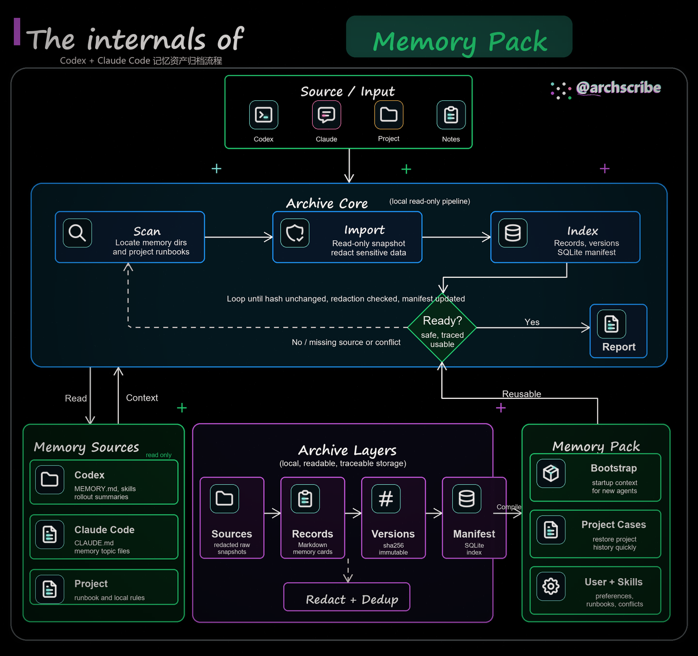
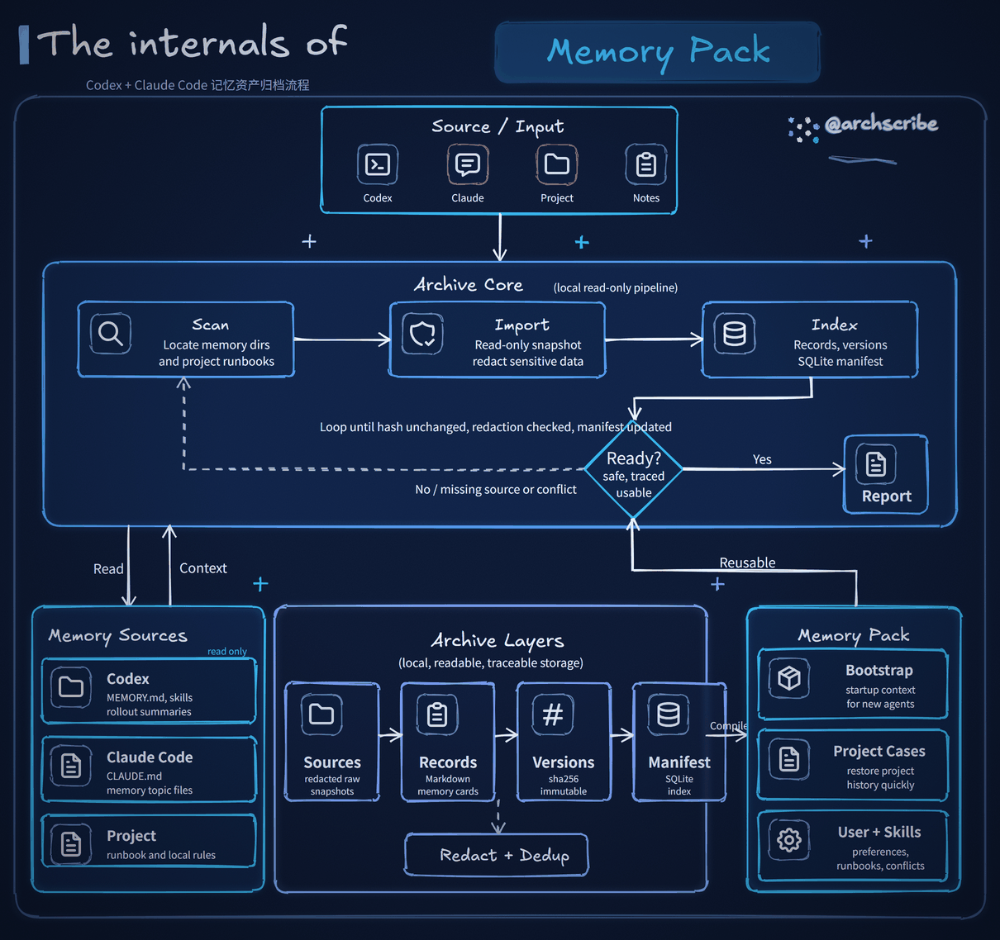
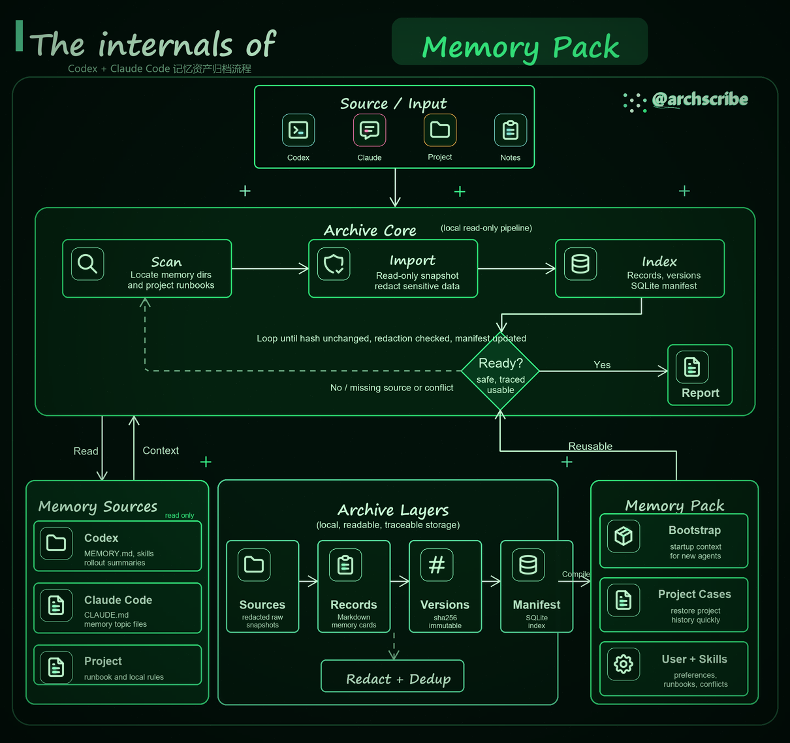

<div align="center">

# Archscribe

**高级手绘风、深色背景的动态架构 / 流程图,专为文章、系统与工作流讲解打造。**

[](./SKILL.md)
[](https://www.python.org/)
[](https://python-pillow.org/)
[](https://excalidraw.com/)
[](./scripts/render_animated_diagram.py)
[](./LICENSE)

`JSON 配置` -> `.excalidraw` + `.png` + 动画 `.gif`

[English](./README.md) · **简体中文**

</div>

<p align="center">
  <a href="#画廊">画廊</a> ·
  <a href="#风格">风格</a> ·
  <a href="#快速开始">快速开始</a> ·
  <a href="#功能特性">功能特性</a> ·
  <a href="#配置结构">配置</a> ·
  <a href="#校验">校验</a>
</p>

`archscribe` 是一个 Codex / Claude 技能 + 本地渲染器,用于生成高级感的深色画布技术图:手绘字体、可编辑的 Excalidraw 源文件、静态 PNG 预览,以及真正会动的 GIF。

它适合用来做文章讲解、系统架构图、流程图,以及 DailyDoseOfDS 风格的深色背景技术草图。

## 画廊

默认视觉系统:深色画布、沿箭头流动的高亮、图标微动效、模块呼吸脉冲、细微颗粒、暗角,以及右上角的手绘签名。

<table>
  <tr>
    <td width="50%" align="center">
      <strong>动画 GIF</strong><br />
      
    </td>
    <td width="50%" align="center">
      <strong>静态 PNG</strong><br />
      
    </td>
  </tr>
</table>

## 风格

Archscribe 内置 **4 套风格**。图的布局、动画、图标完全一致,只有配色(以及浅色风格的收尾处理)不同。通过命令行 `--style` 或配置文件里的 `"style"` 字段选择。

| 风格 | 观感 | 预览 |
| --- | --- | --- |
| `default` | 纯黑底深色手绘霓虹(品牌默认) |  |
| `blueprint` | 深海军蓝单色,技术蓝图感 |  |
| `terminal` | 近黑画布 + 磷光绿 CRT 终端色调 |  |
| `candy` | 浅色纸张底,清新可爱的马卡龙色 |  |

在命令行选择风格(优先级高于配置文件):

```bash
python3 scripts/render_animated_diagram.py \
  --spec assets/default-spec.json \
  --outdir outputs \
  --basename my-diagram \
  --style candy
```

或写进配置 JSON,让该图始终用这套风格渲染:

```json
{
  "style": "blueprint",
  "canvas": { "width": 1210, "height": 1138, "fps": 20, "frames": 41 }
}
```

两者同时存在时,`--style` 优先;都不设置时使用 `default`。

## 功能特性

- 内置 4 套可选风格(`default`、`blueprint`、`terminal`、`candy`),用 `--style` 或配置 `style` 字段切换
- 由一份 JSON 配置生成 `.excalidraw`、`.png` 和动画 `.gif`
- 真实动画:克制的流动光点、模块的微弱强调、清晰的动态 SVG 图标
- `.excalidraw` 源文件保持可编辑、纯文本
- 两种图标引擎:`browser`(无头 Chromium,质量最佳,描边真动画)与 `pillow`(轻依赖回退);`auto` 自动择优
- 使用本地内置的 Tabler SVG 图标子集(MIT 许可),符号干净专业
- 完全离线运行,渲染时不依赖任何远程 API 或远程图标库
- 自带帧差校验,证明 GIF 确实在动
- 采用固定的高质量布局,讲技术故事更清晰

## 输出产物

每次渲染生成:

```text
<basename>.excalidraw
<basename>.png
<basename>.gif
```

默认画布参数:

```text
1210 x 1138
20 fps
41 帧
2.05 秒
```

## 快速开始

```bash
git clone https://github.com/lazypay/Archscribe.git
cd Archscribe
python3 -m pip install -r requirements.txt
python3 scripts/render_animated_diagram.py \
  --spec assets/default-spec.json \
  --outdir outputs \
  --basename sample \
  --verify
```

## 安装

把本文件夹放进你的 Codex 技能目录:

```bash
~/.codex/skills/archscribe
```

常见的本地安装路径:

```bash
${CODEX_HOME:-$HOME/.codex}/skills/archscribe
```

安装运行依赖:

```bash
python3 -m pip install -r requirements.txt
```

## 在 Codex 中使用

按技能名直接调用:

```text
用 $archscribe 把这篇文章做成高级感手绘动态架构 GIF。
```

中文提示词示例:

```text
用 $archscribe 把这篇文章整理成手绘动态架构图（岚叔 / DailyDoseOfDS 风格），输出 GIF、PNG 和 Excalidraw。
```

> 关于浏览器图标引擎:`browser` 引擎是脚本通过 Playwright **自己拉起的无头 Chromium**,与 "Codex 内置浏览器" 无关,无需手动启动。只要装好 `requirements-browser.txt` 与 `python -m playwright install chromium`,后续会自动启用;未安装时会静默回退到 `pillow` 引擎。

## 命令行用法

从内置模板开始:

```bash
cp assets/default-spec.json work/my-diagram-spec.json
```

渲染:

```bash
python3 scripts/render_animated_diagram.py \
  --spec work/my-diagram-spec.json \
  --outdir outputs \
  --basename my-diagram \
  --style default \
  --verify \
  --check
```

`--style` 选择配色:`default`、`blueprint`、`terminal`、`candy`。详见 [风格](#风格)。

`--verify` 会打印抽样的帧间差异。变化像素非零,说明 GIF 确实是动画。

`--check` 校验生成的 PNG、GIF、Excalidraw 是否满足输出契约,任一必需项不通过则以非零码退出。它会检查:尺寸、GIF 帧数与单帧时长、抽样的 GIF 动效、Excalidraw ID 唯一性、文字字体族,以及是否没有内嵌外部文件。

## 配置结构

渲染器以 `assets/default-spec.json` 作为紧凑的美术模板。

最常改动的字段:

```text
style          (可选: default | blueprint | terminal | candy)
signature
title.prefix
title.highlight
title.subtitle
inputs
core.cards
decision
output
left_panel
center_panel
right_panel
```

支持的图标键:

```text
folder  file    scan    shield  db      hash
package message event   api     clock   brain
gear    eye     terminal globe  video   snapshot
server  lock    check   clipboard
```

详细说明见 [references/spec-format.md](./references/spec-format.md)。

## 校验

校验技能结构:

```bash
python3 ${CODEX_HOME:-$HOME/.codex}/skills/.system/skill-creator/scripts/quick_validate.py \
  ${CODEX_HOME:-$HOME/.codex}/skills/archscribe
```

校验 GIF 媒体参数:

```bash
ffprobe -v error -select_streams v:0 -count_frames \
  -show_entries stream=width,height,r_frame_rate,avg_frame_rate,nb_read_frames \
  -show_entries format=duration \
  -of default=noprint_wrappers=1 outputs/my-diagram.gif
```

校验动画:

```bash
python3 scripts/render_animated_diagram.py \
  --spec assets/default-spec.json \
  --outdir outputs \
  --basename sample \
  --verify \
  --check
```

## 依赖

必需:

- Python 3.9+
- Pillow 10.0.0+
- svg.path 7.0+

安装 Python 包:

```bash
python3 -m pip install -r requirements.txt
```

可选(浏览器图标引擎,追求最佳质量时推荐):

```bash
python3 -m pip install -r requirements-browser.txt
python3 -m playwright install chromium
```

可选工具:

- `ffprobe`:检查媒体参数
- Excalidraw 网页版或编辑器插件:手动编辑生成的 `.excalidraw` 文件

## 项目结构

```text
archscribe/
├── SKILL.md
├── README.md            # 英文说明
├── README.zh-CN.md      # 中文说明（本文件）
├── LICENSE
├── requirements.txt
├── requirements-browser.txt
├── agents/
│   └── openai.yaml
├── assets/
│   ├── default-spec.json
│   ├── icons/
│   │   └── tabler/
│   └── previews/
│       ├── memory-pack.gif        # 默认风格，动画主图
│       ├── memory-pack.png
│       ├── style-blueprint.png
│       ├── style-terminal.png
│       └── style-candy.png
├── references/
│   └── spec-format.md
├── scripts/
│   ├── render_animated_diagram.py
│   └── icon_browser.py
└── tests/
    ├── test_render_output_checks.py
    └── test_text_fitting.py
```

## 设计理念

本项目刻意把视觉系统收得很窄:

- 深色画布
- 手绘标题处理
- 顶部输入条
- 中部核心管线
- 底部"来源 / 层 / 成品包"三面板
- 右上角签名
- 静态图保持克制,动效只加在 GIF 叠层(主要是路径光点 + 小幅图标聚焦扫描 / 微光)

这种约束保证不同架构主题下的输出都一致、精致。

## 致谢

这套深色手绘动态视觉风格,灵感来自 **岚叔** 的动态架构图,以及 **DailyDoseOfDS** 风格的深色背景技术草图。Archscribe 是对该观感的独立、开源再实现;原创美学的全部功劳归属于这些创作者。

## 许可证

MIT

`assets/icons/tabler` 中内置的图标来自 Tabler Icons,采用 MIT 许可,详见 `assets/icons/tabler/LICENSE`。
